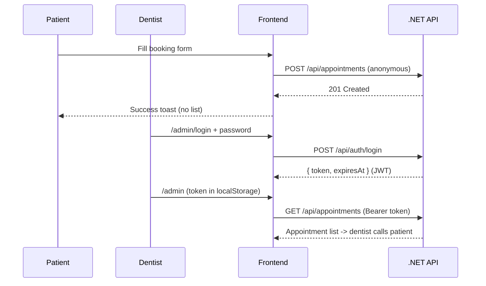

# Admin panel + lock down appointments

## Problem
The public `/appointments` page renders `AppointmentList`, which calls `GET /api/appointments` and exposes every patient's name, email, phone, and notes to anyone. All appointment endpoints on the backend are unauthenticated.

## Goal
- Public page: booking form only, success toast on submit. No list.
- Admin panel: dentist logs in with a single shared password (exchanged for a JWT), sees all booking requests, and updates status / deletes. Clinic calls patients using the phone shown in the admin view.

## Auth flow

## Backend (`tacdent-backend`)

Shared-password login that mints a JWT; protect the management endpoints, leave create open.

- Add package `Microsoft.AspNetCore.Authentication.JwtBearer` (10.0.x) to [src/Tacdent.Api/Tacdent.Api.csproj](src/Tacdent.Api/Tacdent.Api.csproj).
- Config in [src/Tacdent.Api/appsettings.json](src/Tacdent.Api/appsettings.json) (+ Development): an `Auth` section with `AdminPassword`, and `Jwt` (`Issuer`, `Audience`, `Key`, `ExpiryMinutes`). Real values go in `appsettings.Development.json` / user-secrets, not committed defaults.
- **Application layer**: `AuthOptions` (bound from config), `Errors/AuthErrors.cs` with `Auth.InvalidCredentials`, and `IAuthService`/`AuthService` whose `Authenticate(password)` returns `Result` (success or `AuthErrors.InvalidCredentials`). Register in [src/Tacdent.Application/DependencyInjection.cs](src/Tacdent.Application/DependencyInjection.cs).
- **Core**: add `Unauthorized` to [src/Tacdent.Core/Results/ErrorType.cs](src/Tacdent.Core/Results/ErrorType.cs) and an `Error.Unauthorized(...)` factory, since the rule forbids new `ErrorType` values without an Api mapping.
- **Api**: map `ErrorType.Unauthorized -> 401` in [src/Tacdent.Api/Extensions/ResultExtensions.cs](src/Tacdent.Api/Extensions/ResultExtensions.cs). Add a `JwtTokenGenerator` (presentation concern) that builds the token from `JwtOptions`. New `AuthController` (`POST /api/auth/login`) with `LoginRequest` (class) / `LoginResponse` (record) ViewModels and a `LoginRequestValidator`; on `IsFailure` use `result.Error.ToProblemResult()`, else return the token. Register in [src/Tacdent.Api/DependencyInjection.cs](src/Tacdent.Api/DependencyInjection.cs).
- **Protect endpoints** in [src/Tacdent.Api/Controllers/AppointmentsController.cs](src/Tacdent.Api/Controllers/AppointmentsController.cs): `[Authorize]` on `GetAll`, `GetById`, `UpdateStatus`, `Delete`; `[AllowAnonymous]` on `Create`.
- **Program.cs** [src/Tacdent.Api/Program.cs](src/Tacdent.Api/Program.cs): `AddAuthentication(JwtBearer).AddJwtBearer(...)` configured from `JwtOptions`, and add `app.UseAuthentication()` before the existing `app.UseAuthorization()`.

## Frontend (`tacdent-frontend`)

- **Types** [src/types/index.ts](src/types/index.ts): add `LoginPayload` and `LoginResponse { token, expiresAt }`.
- **Token storage**: new `src/lib/auth.ts` with `getToken/setToken/clearToken` (localStorage, client-only).
- **API client** [src/lib/api.ts](src/lib/api.ts): add `login(payload)`; have `request` attach `Authorization: Bearer <token>` when a token exists, and on `401` clear the token so the admin page bounces to login. `getAppointments`, `updateAppointmentStatus`, `deleteAppointment` become authenticated calls.
- **Public page** [src/app/appointments/page.tsx](src/app/appointments/page.tsx): remove `AppointmentList` and the `refreshKey` wiring; keep just `AppointmentForm` (it already shows a success toast). Drop the "Upcoming requests" column.
- **Login schema**: new `src/lib/schemas/login.ts` (zod) following the existing form pattern.
- **Admin login** new `src/app/admin/login/page.tsx`: a `Card` + react-hook-form/zod password form; on success store token and `router.push("/admin")`.
- **Admin panel** new `src/app/admin/page.tsx` (client): redirect to `/admin/login` if no token; render the management list + a logout button. Move/rename `AppointmentList.tsx` into `src/components/admin/` (it already has the status/delete UI and phone field) and reuse it here.
- **Nav**: add a small "Staff login" link in [src/components/layout/Footer.tsx](src/components/layout/Footer.tsx) pointing to `/admin/login` (kept out of the main public nav).

## Notes / decisions
- Client-side JWT in localStorage with a client-side guard on `/admin` (Next middleware can't read localStorage). Adequate for a single-clinic staff panel; can harden later (httpOnly cookie) if needed.
- Login is a shared password per your choice; no user table. Adding multiple dentist accounts later would mean introducing a Users table + hashing.