# Randevu Listesi: Pagination + Filtre + Sorting

Offset pagination (DB seviyesinde `Skip/Take` + `CountAsync`), status filtresi (mevcut), ve ayarlanabilir sorting. JSON kontratı liste yerine sayfalı zarf dönecek (kırıcı değişiklik; frontend ile birlikte güncellenecek).

## Mimari akış

```mermaid
flowchart LR
  UI[AdminAppointmentList] -->|"status,page,pageSize,sortBy,sortDir"| BFF[api/appointments route]
  BFF --> Ctrl[AppointmentsController]
  Ctrl -->|AppointmentQuery| Svc[AppointmentService]
  Svc --> Repo[AppointmentRepository]
  Repo -->|"Where + Count + OrderBy + Skip/Take"| DB[(SQL Server)]
  Repo -->|"PagedResult Appointment"| Svc
  Svc -->|"PagedResult AppointmentDto"| Ctrl
  Ctrl -->|"PagedResult AppointmentResponse"| BFF --> UI
```

## Sözleşme (yeni)

`GET /api/appointments?status=Pending&page=1&pageSize=20&sortBy=PreferredDate&sortDirection=Desc`

Yanıt zarfı (camelCase):
- `items: AppointmentResponse[]`
- `page`, `pageSize`, `totalCount`, `totalPages`, `hasNextPage`, `hasPreviousPage`

## Backend (Core)

- Yeni `src/Tacdent.Core/DTOs/PagedResult.cs`: generic `record PagedResult<T>(IReadOnlyList<T> Items, int Page, int PageSize, int TotalCount)` + computed `TotalPages`, `HasNextPage`, `HasPreviousPage` (get-only prop'lar System.Text.Json ile serileşir).
- Yeni `src/Tacdent.Core/DTOs/AppointmentQuery.cs`: `record AppointmentQuery(AppointmentStatus? Status, int Page, int PageSize, AppointmentSortField SortBy, SortDirection SortDirection)`.
- Yeni enum'lar (Core): `AppointmentSortField { PreferredDate, CreatedAt, Status }`, `SortDirection { Asc, Desc }`.

## Backend (Data)

- [src/Tacdent.Data/Repositories/Interfaces/IAppointmentRepository.cs](src/Tacdent.Data/Repositories/Interfaces/IAppointmentRepository.cs): `GetAllAsync(status,...)` yerine `Task<PagedResult<Appointment>> GetPagedAsync(AppointmentQuery query, CancellationToken ct)`.
- [src/Tacdent.Data/Repositories/AppointmentRepository.cs](src/Tacdent.Data/Repositories/AppointmentRepository.cs):
  - `IQueryable` kur, `status` filtresi uygula, **filtreli sorguda `CountAsync`** (Include/paging'den önce).
  - `ApplySort`: `SortBy`/`SortDirection` switch'i; her zaman `ThenBy(a => a.Id)` tiebreaker ile **stabil** sıra (offset'te satır kayması/tekrarı olmasın).
  - `.Include(AssignedUser).Skip((Page-1)*PageSize).Take(PageSize).ToListAsync`.
  - `PagedResult<Appointment>` döndür.

## Backend (Application)

- [src/Tacdent.Application/Services/Interfaces/IAppointmentService.cs](src/Tacdent.Application/Services/Interfaces/IAppointmentService.cs): `GetAllAsync` → `Task<PagedResult<AppointmentDto>> GetPagedAsync(AppointmentQuery query, CancellationToken ct)`.
- [src/Tacdent.Application/Services/AppointmentService.cs](src/Tacdent.Application/Services/AppointmentService.cs): repo'dan `PagedResult<Appointment>` al, `mapper.ToDtoList(items)` ile map'le, aynı sayfa metadata'sıyla `PagedResult<AppointmentDto>` kur. (Mapperly `ToDtoList` aynen kalıyor.)

## Backend (Api)

- Yeni ViewModel `AppointmentQueryRequest(AppointmentStatus? Status, int Page = 1, int PageSize = 20, AppointmentSortField SortBy = PreferredDate, SortDirection SortDirection = Desc)`.
- [src/Tacdent.Api/Controllers/AppointmentsController.cs](src/Tacdent.Api/Controllers/AppointmentsController.cs): `GetAll([FromQuery] AppointmentQueryRequest request, ...)`, `factory.ToQuery(request)` → `service.GetPagedAsync` → `PagedResult<AppointmentResponse>` döndür (`items.Select(factory.ToResponse)`). Zarf olarak Core'daki `PagedResult<T>` doğrudan kullanılabilir, ayrı ViewModel gerekmez.
- [src/Tacdent.Api/Factories/AppointmentFactory.cs](src/Tacdent.Api/Factories/AppointmentFactory.cs) + `IAppointmentFactory`: `ToQuery(AppointmentQueryRequest)` ekle.
- Yeni `src/Tacdent.Api/Validators/AppointmentQueryRequestValidator.cs`: `Page >= 1`, `PageSize` 1..100 (mevcut FluentValidation pattern'i ile).

## Frontend

- [src/types/index.ts](src/types/index.ts): `PagedResult<T>` arayüzü; `AppointmentSortField`, `SortDirection` tipleri.
- [src/lib/api.ts](src/lib/api.ts): `getAppointments(params: { status?; page; pageSize; sortBy; sortDirection })` → query string kurup `PagedResult<Appointment>` döndür.
- [src/app/api/appointments/route.ts](src/app/api/appointments/route.ts): tüm query paramlarını (`status,page,pageSize,sortBy,sortDirection`) backend'e ilet.
- shadcn `tabs` bileşeni ekle (`npx shadcn@latest add tabs`) — proje kuralı gereği primitive'den kur.
- [src/components/admin/AdminAppointmentList.tsx](src/components/admin/AdminAppointmentList.tsx):
  - Status **tab'leri** (varsayılan `Pending`; Confirmed/Completed/Cancelled/All).
  - Sıralama: `sortBy` için `Select` (Preferred date / Created / Status) + yön toggle butonu.
  - Pagination: Prev/Next butonları + "Page X of Y" (`hasNextPage`/`hasPreviousPage`/`totalPages`).
  - State: `status,page,sortBy,sortDirection`; değişimde refetch; filtre/sort değişince `page=1`'e dön. Boş-durum metnini aktif filtreye göre güncelle.

## Testler

- [tests/Tacdent.UnitTests/Application/AppointmentServiceTests.cs](tests/Tacdent.UnitTests/Application/AppointmentServiceTests.cs): `GetAllAsync` testini `GetPagedAsync`'e çevir; repo mock `PagedResult<Appointment>` dönsün; sayfa metadata'sının (page/pageSize/totalCount) korunduğunu ve `AppointmentQuery`'nin repo'ya geçtiğini doğrula.
- Backend `dotnet build` + `dotnet test` yeşil; frontend `npm run build` yeşil.

## Kapsam dışı (sonraya)
- Keyset/cursor pagination.
- Sunucu taraflı arama (isim/telefon) — istenirse `AppointmentQuery`'ye eklenir.