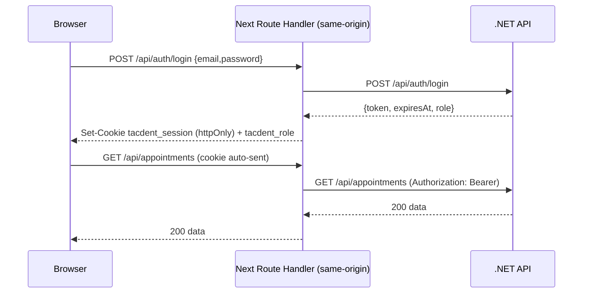

# Role-based authorization + httpOnly cookie (BFF)

## Part 1 - Role-based authorization (backend)

The JWT already carries the role claim (`ClaimTypes.Role`) from [JwtTokenGenerator.cs](src/Tacdent.Api/Auth/JwtTokenGenerator.cs), and `[Authorize]` already protects the controller. We only need to gate the Admin-only action and surface the role on login.

- New `src/Tacdent.Api/Auth/Roles.cs` with `public const string Admin = nameof(UserRole.Admin);` to avoid magic strings.
- [AppointmentsController.cs](src/Tacdent.Api/Controllers/AppointmentsController.cs): add `[Authorize(Roles = Roles.Admin)]` to the `Delete` action. `GetAll`/`GetById`/`UpdateStatus` stay `[Authorize]` (any Staff); `Create` stays `[AllowAnonymous]`.
- [LoginResponse.cs](src/Tacdent.Api/ViewModels/LoginResponse.cs): add `string Role` -> `record LoginResponse(string Token, DateTime ExpiresAt, string Role)`.
- [AuthController.cs](src/Tacdent.Api/Controllers/AuthController.cs): pass `result.Value.Role.ToString()` into the response. No service/JWT changes needed.
- Tests: add a small assertion in the unit suite that `Roles.Admin == "Admin"` matches the emitted claim in [JwtTokenGeneratorTests.cs](tests/Tacdent.UnitTests/Api/JwtTokenGeneratorTests.cs). (Attribute-level enforcement is integration-scope; noted as optional.)

## Part 2 - httpOnly cookie via Next.js BFF

The browser will only ever talk to same-origin Next.js route handlers. Those handlers hold the token in a first-party httpOnly cookie and forward it to the .NET API as a Bearer header server-side. The .NET API stays a stateless Bearer-JWT resource server (no backend cookie/CORS changes). `cookies()` is async in Next 16 (verified in bundled docs).

### New route handlers (`src/app/api/`)
- `auth/login/route.ts` (POST): forward to backend `/api/auth/login`; on success set httpOnly `tacdent_session` (token, `sameSite: "lax"`, `secure` in prod, `maxAge` from `expiresAt`) plus a readable `tacdent_role` cookie for UI gating; return `{ role }`. Forward non-2xx status/body through (e.g. 401/429).
- `auth/logout/route.ts` (POST): delete both cookies.
- `appointments/route.ts` (GET): read `tacdent_session`, forward to backend with Bearer + `status` query.
- `appointments/[id]/status/route.ts` (PATCH) and `appointments/[id]/route.ts` (DELETE): same Bearer forwarding. A shared `src/lib/server/backend.ts` helper builds the backend URL (`process.env.API_URL ?? NEXT_PUBLIC_API_URL`) and Bearer header, and maps a missing cookie to 401.
- Public calls (`getServices`, `createAppointment`) keep calling the backend directly - no cookie needed.

### Client lib changes
- Replace [src/lib/auth.ts](src/lib/auth.ts): remove `localStorage` token get/set/clear. Auth state is derived from the readable `tacdent_role` cookie (helper `getRole()` reading `document.cookie`).
- [src/lib/api.ts](src/lib/api.ts): drop `getToken()`/`Authorization` header. Admin calls (`getAppointments`, `updateAppointmentStatus`, `deleteAppointment`) hit relative Next routes (`/api/...`); add `logout()` -> `POST /api/auth/logout`. `login()` -> `POST /api/auth/login`. Keep the 401 -> "session expired" handling.

### Route guard + UI
- New `src/middleware.ts`: redirect `/admin/:path*` (except `/admin/login`) to `/admin/login` when `tacdent_session` is absent (UX guard; real enforcement stays on the backend).
- [src/app/admin/login/page.tsx](src/app/admin/login/page.tsx): on submit call `login()` (cookie set server-side), then `router.push("/admin")` - no `setToken`.
- [src/app/admin/page.tsx](src/app/admin/page.tsx): convert to a Server Component that reads `tacdent_role` via `await cookies()` and passes `isAdmin` to the list; `handleLogout` calls `logout()` then redirects.
- [src/components/admin/AdminAppointmentList.tsx](src/components/admin/AdminAppointmentList.tsx): accept `isAdmin` prop; render the Delete dialog only when `isAdmin` (Staff sees view + status only, matching the backend rule).

### Config
- Add `API_URL` (server-only) to frontend env for route handlers; keep `NEXT_PUBLIC_API_URL` for the direct public calls. CSP `connect-src` in [next.config.ts](next.config.ts) already allows `'self'` (BFF) and the API URL (public calls) - no change.

## Verification
- Backend: `dotnet build` + `dotnet test` green; Staff token gets 403 on DELETE, Admin gets 204.
- Frontend: `npm run build` + `npm run lint`; login sets an httpOnly cookie (not visible in `localStorage`/JS), admin list loads, Staff UI hides Delete, logout clears the cookie, expired token -> 401 -> redirect to login.

## Out of scope (future)
- CSRF token (SameSite=Lax already blocks cross-site mutations), refresh-token rotation, user-management UI/endpoints, JWT key rotation, audit log.