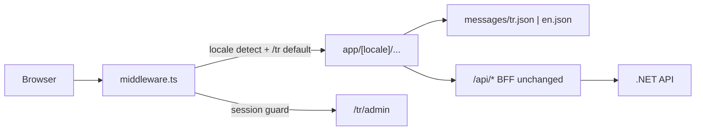

# Site Dil Desteği (TR + EN)

`next-intl` ile locale-prefix routing (`/tr/...`, `/en/...`). Varsayılan: **Türkçe**. Kapsam: **public site + admin panel + form validasyonları + toast mesajları**.

## Mimari



- **Çevrilir:** Header, Footer, tüm sayfa metinleri, admin UI, zod hata mesajları, toast metinleri, appointment status *görünen* etiketleri.
- **API değerleri aynı kalır:** `Pending`, `General Checkup` gibi backend kontratı değişmez; UI'da `t('status.Pending')` ile gösterilir.
- **Hizmetler (5 seed kayıt):** Backend'e dokunmadan [`DentalServiceConfiguration.cs`](src/Tacdent.Data/Configurations/DentalServiceConfiguration.cs) ID'leri (1–5) ile `messages/*.json` içinde `services.items.{id}.name/description` overlay. Fiyat formatı locale'e göre (`tr`: `₺`, `en`: `$`).

## 1. Altyapı

**Bağımlılık:** `next-intl`

**Yeni dosyalar:**
- [`src/i18n/routing.ts`](src/i18n/routing.ts) — `locales: ['tr', 'en']`, `defaultLocale: 'tr'`, `localePrefix: 'always'`
- [`src/i18n/request.ts`](src/i18n/request.ts) — server-side message loading
- [`src/i18n/navigation.ts`](src/i18n/navigation.ts) — locale-aware `Link`, `useRouter`, `redirect`, `usePathname`
- [`messages/tr.json`](messages/tr.json), [`messages/en.json`](messages/en.json) — namespaced keys

**next.config.ts:** `createNextIntlPlugin()` wrapper ([next-intl App Router setup](https://next-intl.dev/docs/getting-started/app-router))

**App Router yeniden yapılandırma:**
- Mevcut sayfalar [`src/app/`](src/app/) altından [`src/app/[locale]/`](src/app/[locale]/) altına taşınır: `page.tsx`, `services/`, `about/`, `contact/`, `appointments/`, `admin/`
- [`src/app/api/`](src/app/api/) **kökte kalır** (locale'siz)
- Kök [`layout.tsx`](src/app/layout.tsx) minimal (fontlar); [`src/app/[locale]/layout.tsx`](src/app/[locale]/layout.tsx) → `lang={locale}`, `NextIntlClientProvider`, Header/Footer
- Kök `page.tsx` kaldırılır; `/` isteği middleware ile `/tr`'ye yönlendirilir

## 2. Middleware birleştirme

[`src/middleware.ts`](src/middleware.ts) güncellenir — iki sorumluluk zincirlenir:

1. `next-intl` middleware (locale prefix, default `tr`)
2. Admin auth: pathname'den locale çıkar (`/tr/admin` → `/admin`), `tacdent_session` yoksa `/{locale}/admin/login`'e redirect

`matcher`: locale rotaları + mevcut admin guard kapsamı.

## 3. Çeviri dosyaları (namespace önerisi)

| Namespace | İçerik |
|-----------|--------|
| `common` | nav, footer, buttons, language switcher |
| `home` | hero, highlights, testimonials, CTA |
| `services` | sayfa metinleri + `items.{id}.name/description` |
| `about`, `contact` | sayfa içerikleri |
| `appointments` | booking form labels, success/error |
| `admin` | login, dashboard, user management, appointment list |
| `validation` | zod mesajları |
| `status` | Pending, Confirmed, Cancelled, Completed |
| `metadata` | `title`, `description` per page |

## 4. Bileşen güncellemeleri

**Server Components** (`services/page.tsx`, `about/page.tsx`, vb.):
- `getTranslations('services')` ile metinler
- `generateMetadata` locale'e göre

**Client Components** (`Header.tsx`, `AppointmentForm.tsx`, admin bileşenleri):
- `useTranslations('common')` vb.
- `next/link` → `@/i18n/navigation` `Link`
- Hardcoded string'ler `t('key')` ile değiştirilir

**Header'a dil toggle butonu:** Yeni [`src/components/layout/language-toggle.tsx`](src/components/layout/language-toggle.tsx) — `ThemeToggle` ile aynı stil/konum (yanına yerleşir). İki dil olduğu için dropdown yerine **iki durumlu segmented toggle**: `TR | EN`, aktif dil vurgulu. `"use client"`, `useLocale()` ile aktif dili okur; `useRouter` + `usePathname` (`@/i18n/navigation`) ile mevcut path'i koruyarak diğer locale'e geçer (`/tr/services` ↔ `/en/services` — sadece prefix değişir). `aria-label` + `aria-pressed` ile erişilebilir. Mobil sheet menüsüne de eklenir.

> Not: Path segmentleri İngilizce kalır (`/tr/services`); SEO için slug çevirisi (`/tr/hizmetler`) bu planda **yok**.

## 5. Formlar ve validasyon

[`src/lib/schemas/appointment.ts`](src/lib/schemas/appointment.ts), [`login.ts`](src/lib/schemas/login.ts), [`user.ts`](src/lib/schemas/user.ts):
- Factory pattern: `createAppointmentFormSchema(t: TranslationFn)` — client form'da `useTranslations('validation')` ile oluşturulur
- Mevcut export'lar kaldırılır veya default EN bırakılmaz; tüm formlar factory kullanır

## 6. Admin özel notlar

- Login sonrası `router.push('/admin')` → locale-aware `router.push('/admin')` (next-intl navigation otomatik prefix ekler)
- [`src/app/admin/page.tsx`](src/app/admin/page.tsx) server component: `cookies()` okuma aynı kalır
- Staff/Admin rol metinleri `admin` namespace'inde
- API hata mesajları (backend İngilizce): bilinen mesajlar için frontend mapping (`errors.sessionExpired` vb.); bilinmeyenler olduğu gibi gösterilir

## 7. Hizmet overlay helper

[`src/lib/services.ts`](src/lib/services.ts) (yeni):
```ts
function localizeService(service, t): { name, description }
// t(`services.items.${service.id}.name`) fallback → service.name
```
`ServicesCarousel`, `services/page.tsx`, `AppointmentForm` service select bu helper'ı kullanır.

## 8. Doğrulama ve dokümantasyon

- `npm run build` yeşil
- Manuel: `/` → `/tr`, dil değiştirme, `/tr/admin` auth guard, form validasyon mesajları TR/EN
- [`README.md`](README.md) ve [`LEARNING.md`](LEARNING.md): i18n yapısı, `messages/` konvansiyonu, yeni string ekleme rehberi

## Kapsam dışı (sonraya)

- Backend `Accept-Language` / çok dilli `DentalService` tablosu
- URL slug çevirisi (`/tr/hizmetler` vs `/en/services`)
- Backend API error code kataloğu lokalizasyonu
